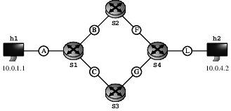

# P4 Multipath Transmissions Emulated by Kathará
All examples for the P4 transmissions are integrated into a simple topology, which consists of two hosts (*h1* and *h2*) and four P4 enabled switches (*s1* to *s4*)



## Installation Prerequisites

### Linux
* Install [Docker](https://www.docker.com/). We suggest installing Docker from this [script](https://get.docker.com).
* *Suggested*: Install tmux (usually `sudo apt install tmux`) and specify it as a different terminal emulator by using the `kathara settings` command.
* Add Kathará public key to your keyring:
```
sudo apt-key adv --keyserver keyserver.ubuntu.com --recv-keys 21805A48E6CBBA6B991ABE76646193862B759810
```
* Add the Kathará repo to your repos on **Debian** based systems:
```
  sudo add-apt-repository ppa:katharaframework/kathara
```
* Update your apt cache by running `sudo apt update`
* Install Kathará running `sudo apt install kathara`  


### Windows
* Install [Docker](https://www.docker.com/)
* During the installation procedure **do not** flag *Use Windows Containers*, Kathará works only with default (Linux) containers.
* Download the setup file to a directory of your choice from a [Release](https://github.com/KatharaFramework/Kathara/releases).
* You may also need to share the drive that will contain the labs and the drive with your user folder (it can be done from Docker settings, from the tray icon), as shown [here](https://github.com/KatharaFramework/Kathara/wiki/InstallationGuides/InstallationImages/winshare.png) (note that you may have/need different drives).
* Run the setup wizard and follow the instructions.
* Remember to run Docker before using Kathará.

Please note that Docker runs on Windows inside a virtual machine running Linux and is managed by Hyper-V. The virtual hard drive usually takes a variable amount of space depending on the number of Docker images that you compile and can go up to about 60 GBytes. However the space occupation can be drastically reduced by removing unused Docker images with the command `docker system prune` and by following this [procedure](https://github.com/KatharaFramework/Kathara/wiki/HyperV-Space-Reduction). This can be used every time your virtual disk space goes up because of some Docker Images you later decide to remove


### Mac
* Install [Docker](https://www.docker.com/).
* Download the setup file to a directory of your choice from a [Release](https://github.com/KatharaFramework/Kathara/releases).
* Run the setup wizard and follow the instructions.
* Remember to run Docker before using Kathará.

Please note that Docker runs on MacOS inside virtual machine running Linux and is managed by a proprietary hypervisor.


## Prototypes

### Random Split

Navigate into the folder `random_split` and start the laboratory with `kathara lstart`.
To access the machines of the topology, you may use `tmux` and call `tmux a -t RandomSplit`.

Application execution:
* *h2* acts as server and must start the receiving applications first, which are executed by calling:
  * `python3 TCPserver.py`
  * `python3 UDPserver.py`
  * `iperf [-u] -s`
* *h1* acts as client and the installed programs can be executed, which are
  * `python3 TCPclient.py`
  * `python3 UDPclient.py server [message]`
  * `iperf [-u] -c server`


### Duplicate

Navigate into the folder `duplicate` and start the laboratory with `kathara lstart`.
To access the machines of the topology, you may use `tmux` and call `tmux a -t Duplicate`.

Application execution:
* *h2* acts as server and must start the receiving applications first, which are executed by calling:
  * `python3 TCPserver.py`
  * `python3 UDPserver.py`
  * `iperf [-u] -s`
* *h1* acts as client and the installed programs can be executed, which are
  * `python3 TCPclient.py`
  * `python3 UDPclient.py server [message]`
  * `iperf [-u] -c server`

## Wireshark

### Attaching a Wireshark Container Manually

Adding Wireshark to the laboratory can be done with an additional container:
```
docker run -d --name=wireshark --cap-add=NET_ADMIN --restart unless-stopped -p 3000:3000 lscr.io/linuxserver/wireshark:latest
```
Thereafter, the network to analyze can be found with Docker and must be added to the wireshark container:
```
docker network ls
docker network connect kathara_[...-id_A] wireshark
```
Now, a web browser can be opened on [localhost](http://localhost:3000/?login=true) and Wireshark can be accessed after its initialization. Use *eth1* to capture on the connected network.

[**Remark:**] The described procedure works on all operating systems, as we use a Linux-based Wireshark container, which has direct access to the underlying network.

### Modifiying the Laboratory Configuration

Adding Wireshark directly to the collision domains can be done by adding a Wireshark node to the `lab.conf` file, wherever it is needed.
With the following example you can capture on collision domain A:

```
wireshark[0]=A
wireshark[bridged]=true
wireshark[image]="lscr.io/linuxserver/wireshark"
```

After starting the laboratory with `kathara lstart`, a web browser can be opened on [localhost](http://localhost:3000/?login=true) and Wireshark can be accessed after its initialization. Use *eth1* to capture on the connected network.
